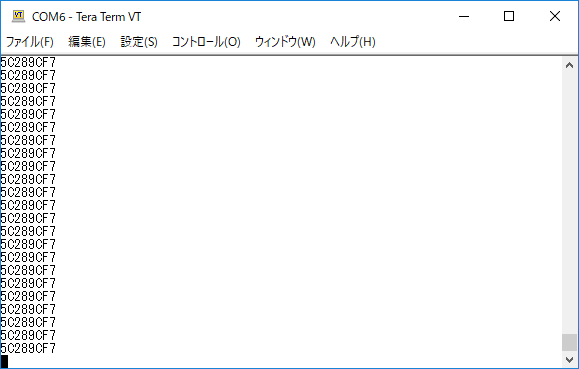

# How to get the timestamp in FPGA
---
Many FPGA engineers are troubled with version control,
Because of loss of using the ROM version.

I propose a method to automatically give the version to the FPGA every compilation.
This method will solve this problem.

# Description 
So timestamp is solveing this problem. but FPGA configuration ROM have not user payload.How to put/get timestamp code?
I propose this idea.

## Idea
1.   In every compile start timing, compiler fire this Tcl script. (Mainly FPGA compiler have compile start timing Tcl hook.)
2.  This Tcl script make a HDL code include timestamp parameter. 
3. And you write HDL is using timestamp parameter, it read by SPI , UART, I2C, DMA and any way.

## implement
I show you Altera Quartus & Verilog version. I think OK, similer way may tool & VHDL.
show sample code you get more detail.

1. ***TIMESTAMP.tcl***

tcl script make file "TIMESTAMP.v" that include this parameter code.
```verilogHDL:sample
parameter [31:0] C_TIMESTAMP = <ctime at compile start> ;
```
in unix time format.


2. ***set Hook compile starting script***

append this line in your qpf pjoject file.
```
set_global_assignment -name PRE_FLOW_SCRIPT_FILE "quartus_sh:./RTL/TIMESTAMP.tcl"
```


3. ***use timestamp in your FPGA via HDL***

you can use your HDL this code.
```verilogHDL:sample
`include "TIMESTAMP.v"
```
I show "UART timesampe talker" in sample code.
This send 32bit timestamp in UART ASCII HEX 8char and crlf repeat.
    
# Usage

1. ***clone***

2. ***comile***

I'm compiled Quartus lite v18.0


3. ***PIN***

```text:
pin_name    pin#    usage
CK_i        62      system clock     in CQ_MAX10-FB std 48MHz 
XARST_i     123     system reset "L" in QC_MAX10-FBpush switch
TXD_o       26      UART output

```

4. ***UART***

```text:
UART parameter :
19200 baud at 48MHz master clock
8bit non_parity stop1
I send lineend  \r\n
```
you can rescieve UART(com) your term you like.
If you want other speed master clock , you set parameter C_FCK.
and other baud rate , Set C_BAUD_RATE.


5. ***Simulation***

./RTL/TIMESTAMP_MAIN.v
include testbench module TB_TIMESTAMP_MAIN()


# Log
2018-12-31mo : 1st release.

# Features


# Demo
show !

got time stamp in uart term
 


## Requirement

writen in Verilog HDL. & Altera Quartus
it active in VHDL and (vivado,Libero & Diamond) simuler way 


#platform: 

  CQ MAX10-FB (Altera MAX10:10M08SAE144C8)
  master clock is 48MHz
 but may be can use any FPGA/ASIC


## Help:  http://mangakoji.hatenablog.com/


## Licence:
----------
Copyright &copy; @manga_koji 2018-12-31mo
Distributed under the [MIT License][mit].
[MIT]: http://www.opensource.org/licenses/mit-license.php


enjoy making ! ;-)

